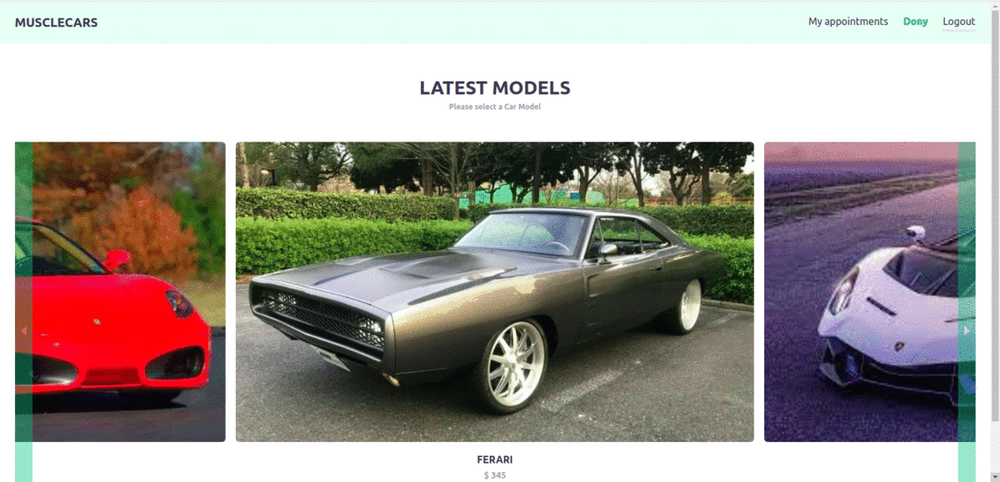

# Muscle Cars

This project is a booking application. The project includes the basic features of

- Signing up, logging in, and logging out
- Checking a list of cars to test drive
- Checking specific car details
- Booking a car to test drive at a date and in a city
- Checking the list of your appointments

The app is using an [API](https://github.com/ericmbouwe/musclecars-api).

## Live Demo
Please check [live demo of the project.](https://musclecarsapp.herokuapp.com/)

## Built With

- React
- Redux
- Tailwind CSS
- react-carousel
- axios
- Jest

## Getting Started

To get a local copy up and running follow these simple example steps.

### Prerequisites

Make sure Node.js is running on your local machine.

## Setup

- Clone this repository
- Open terminal
- Change directory by using `cd musclecars-app`
- Run `npm install`

### Usage

- Run `npm start`
- Open a browser and go to http://localhost:3000

## Test app

- Clone this repository
- Open terminal
- Change directory by using `cd musclecars-app`
- Run `npm install`
- Run `npm test` to test all files

# Authors

Reach out to me at one of the following places!

👤 **Eric Mbouwe**

- Website: [ericmbouwe.com](https://ericmbouwe.netlify.app/)
- LinkedIn: [Eric Mbouwe](https://www.linkedin.com/in/ericmbouwe/)
- Github: [@ericmbouwe](https://github.com/ericmbouwe)
- Twitter: [@ericmbouwe](https://twitter.com/ericmbouwe)
- Mail: [ericmbouwe@gmail.com](mailto:ericmbouwe@gmail.com)

## 🤝 Contributing

Contributions, issues and feature requests are welcome!

Feel free to check the [issues page](https://github.com/ericmbouwe/musclecars-app/issues).

## Show your support

Give a ⭐️ if you like this project!

## Acknowledgments

Design is inspired by [work](https://www.behance.net/gallery/26425031/Vespa-Responsive-Redesign) of [Murat Korkmaz on Behance](https://www.behance.net/muratk). Thanks to Gregoire Vella for the inspiration.

Thanks to;

- [Microverse Inc](https://www.microverse.org/)
 